

  

  

  
  
  
  

<!-- ABOUT -->



<!-- SKILLS -->


<b>💻 Programming</b>  
  

<b>🤖 AI / ML / GenAI</b>  
    
  
  
  
  
  
  
  
  
  

<b>📊 Data Analytics</b>  
  
  
  
  
  

<b>🌐 IoT & Embedded Systems</b>  
    
  
  
  

<b>🧰 Tools</b>  
    
  
  

<!-- PROJECTS -->


  
  

  
  

  
  

  
  

<!-- EXPERIENCE -->


  
  

<!-- CERTIFICATIONS -->


  
  

<!-- STATS -->


  
  

  

  

<!-- INTERESTS -->


  
  
  
  
  
  
  
  
  
  
  

<!-- GOAL -->


  <i>To build innovative technology solutions by combining Artificial Intelligence, Data Analytics, IoT and Software Engineering, 
  while continuously improving my skills and contributing to meaningful projects that create real-world impact.</i>

<!-- CONNECT -->


  
  
  


